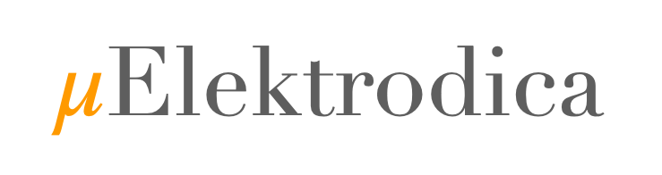

# *μ*Elektrodica
Uxmal 1.0.0

A Python Electrochemistry Toolbox for Modeling Microkinetic Electrocatalytic Reactions.
The package provides example datasets and tutorials designed to demonstrate how the functions can be utilized.

## Installation

*μ*Elektrodica can be installed using `pip`

    pip install melektrodica

or via GitHub

    git clone https://github.com/CarlosBaqueiro/MicroElektrodica.git
    cd melektrodica
    pip install .

## Package Layout and Documentation

    ...
    docs
    melektrodica/
    ├── calculator/
    ├── collector/
    ├── constants/
    ├── coordinator/
    ├── fitter/
    ├── grapher/
    ├── kpynetic/
    ├── tools/
    ├── writer/
    tests
    ...

### Dependencies libraries

- Python 3.2,
- SciPy,
- NumPy,
- re,
- os,
- Matplotlib,
- NetworkX
- Copy
- Warnings

## Citing

A peer-reviewed article is currently in progress. Stay tuned for the DOI!

## Copyright and License

Copyright (C) 2025 C. Baqueiro Basto, M. Secanell, L.C. Ordoñez
*μ*Elektrodica is licensed under Creative Commons Attribution-NonCommercial-ShareAlike 4.0 International License. See
license file for more information.

