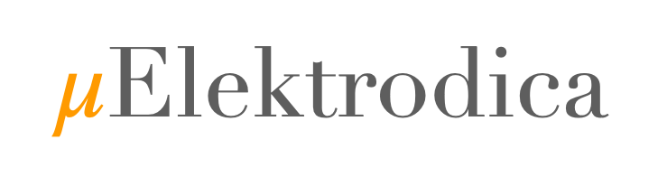

.. _index:

Overview
============
μElektrodica is an open--source tool for Electrocatalytic Reactions Microkinetic Modeling developed in Python, featuring a modular architecture that enables easy understanding of the algorithm and rapid adaptation to available experimental or thermodynamic parameters.

.. toctree::
   :maxdepth: 1

    Overview <self>
    Installation <installation>
    Tutorials <tutorials>
    Development <development>
    API Documentation <apidoc>
